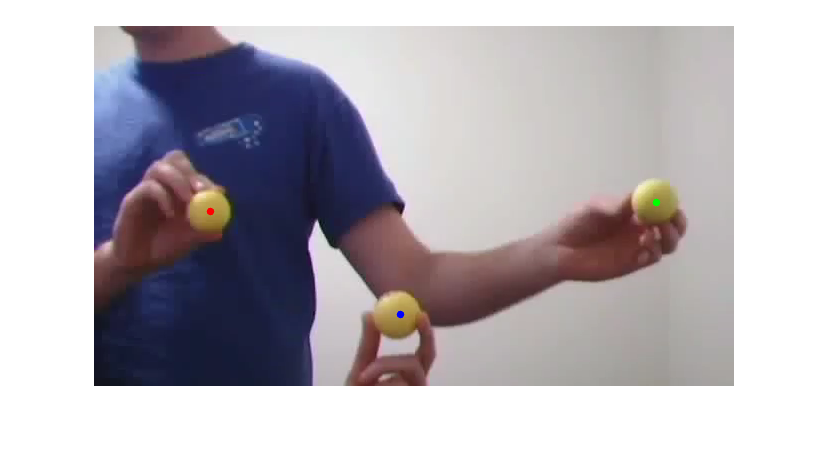

### Chris Cronin, Andrew Gardner
### Fall 2015 ECE 5554/4984 Computer Vision: Class Project
### Virginia Tech
  
# Abstract
Gesture control is an interesting feature that has been tested in many modern applications. The motivation behind our project was to accomplish the first step of gesture control and be able to track objects through a video. To simplify the task we tracked bright yellow balls through a video using the LAB colorspace. We then used the average of the positions of the pixels identified to obtain the center of each individual ball and used proximity to ensure the same center stayed with the same ball from frame to frame. We developed a system in MATLAB that was capable of taking a video file, parsing it into frames, identify the centers of the balls, and track those centers throughout. There are some slight issues where if a ball is initially in the video then leaves and re-enters it will not be tracked and the centers will get mixed up.

# Teaser Figure

Balls used as markers shown with the centers identified

# Introduction
Something seen in many sci-fi films is the use of computers through gesture control. The first step to be able to move towards this feature is the ability to track the object being used to make the gesture. For our project we solve a simplified problem and track the centers of yellow balls through a video. In order to do this we do some computations on each individual frame of the video which we get by splitting the video into frames within MATLAB. We also use the the LAB colorspace instead of the RGB colorspace since the balls we use are significantly brighter than the rest of the content in each frame. This is highly dependent on the lighting of the setting the motion tracking is occurring in so our system does assume that the lighting will remain the same throughout the video and does require to some initial user input in order to get the appropriate bounds so only the balls will be identified their brightness. Motivation behind the problem you are solving, what applications it has, any brief background on the particular domain you are working in (if not regular RBG photographs), etc. If you are using a new way to solve an existing problem, briefly mention and describe the existing approaches and tell us how your approach is new.

# Approach
Describe very clearly and systematically your approach to solve the problem. Tell us exactly what existing implementations you used to build your system. Tell us what obstacles you faced and how you addressed them. Justify any design choices or judgment calls you made in your approach. 

# Experiments and results
Provide details about the experimental set up (number of images/videos, number of datasets you experimented with, train/test split if you used machine learning algorithms, etc.). Describe the evaluation metrics you used to evaluate how well your approach is working. Include clear figures and tables, as well as illustrative qualitative examples if appropriate. Be sure to include obvious baselines to see if your approach is doing better than a naive approach (e.g. for classification accuracy, how well would a classifier do that made random decisions?). Also discuss any parameters of your algorithms, and tell us how you set the values of those parameters. You can also show us how the performance varies as you change those parameter values. Be sure to discuss any trends you see in your results, and explain why these trends make sense. Are the results as expected? Why?

# Qualitative results
Show several visual examples of inputs/outputs of your system (success cases and failures) that help us better understand your approach. 
